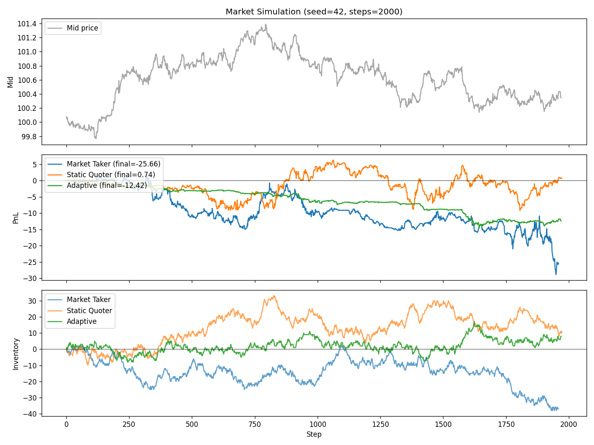

# Limit Order Book Trading Agent

 

A simulated limit order book (LOB) exchange with a market-making agent that adaptively chooses between liquidity provision and market taking using **order-flow imbalance (OFI)** as its primary signal.

## Highlights

- **Simulated exchange** with limit and market orders, price-time priority matching, and cancellation.
- **Three agents** for comparison: `MarketTaker` (baseline), `StaticQuoter` (symmetric two-sided market making), and `AdaptiveAgent` (OFI-driven quoting + market taking).
- **Order-flow imbalance signal** computed from signed trade flow over a rolling window, combined with top-of-book volume imbalance.
- **Adverse-selection protection** via asymmetric quote widening: the side being pressured by informed flow is backed off; the other side tightens.
- **Inventory skew** using a reservation-price style adjustment that nudges quotes toward flattening position.
- **Backtesting harness** runs thousands of i.i.d. market histories.

## Results (10 000 simulations × 500 steps)

| Agent         | Mean PnL | Median PnL | PnL Std | Mean Inventory Drawdown |
|---------------|---------:|-----------:|--------:|------------------------:|
| Market Taker  |   -4.05  |    -3.97   |   6.03  |          23.9           |
| Static Quoter |   -3.45  |    -1.65   |   6.78  |          26.0           |
| **Adaptive**  | **-2.56**|  **-2.10** | **2.42**|       **14.8**          |

- **Adaptive outperforms the market-taker baseline by +1.49 mean PnL** across 10k simulations.
- **Inventory drawdown reduced by 43% vs the static quoter** — inventory-aware skew works as designed.
- **PnL variance ~2.5× tighter** than either baseline — quote widening on strong OFI avoids the large adverse-selection events that hurt the static quoter.



*Top: mid-price series with inventory trajectories. Middle: agent PnL over one 2000-step episode (seed 42). Bottom: inventory drawdown. The adaptive agent's inventory stays near zero thanks to OFI-driven skew.*

(Run `python3 experiments/run_simulations.py --sims 10000 --steps 500 --workers 4` to reproduce.)

## Project layout

```
lob/
  order.py           # Order, Side, OrderType
  book.py            # OrderBook with price-time priority
  market.py          # Poisson flow simulator with informed-trader bias
  backtest.py        # Simulation harness
  agents/
    base.py          # Common PnL / inventory bookkeeping
    taker.py         # Random market-taking baseline
    static_quoter.py # Fixed-spread symmetric market maker
    adaptive.py      # OFI-driven adaptive agent
experiments/
  run_simulations.py # Batch runner with multiprocessing
  plot_results.py    # PnL / inventory / mid-price plots
tests/
  test_book.py
  test_agents.py
```

## How the adaptive agent works

On each step the agent:

1. **Computes the OFI signal** from the stream of recent executed trades (signed by aggressor side), normalized by rolling volatility of that flow. Combined with top-of-book volume imbalance for a stabler short-horizon view.
2. **If |signal| > `take_threshold`** and inventory is not near its cap, it **crosses the spread** in the signal direction — this captures directional moves that would otherwise pick off its quotes.
3. **Otherwise** it posts two-sided limit quotes around mid, with:
   - Base spread (`base_spread_ticks`)
   - Asymmetric **widening** of the pressured side (proportional to `|signal|`) to avoid adverse selection
   - Inventory **skew** that pushes quotes in the direction that reduces position

## Baselines

- `MarketTaker`: Bernoulli-triggered market order each step, side uniform. Pays spread on every fill — a deliberately unprofitable baseline.
- `StaticQuoter`: Re-quotes at `mid ± spread/2` every step. Collects spread but has no adverse-selection defense or inventory management — its inventory can drift significantly.

## Install & run

```bash
pip install -r requirements.txt

python3 tests/test_book.py
python3 tests/test_agents.py

python3 experiments/plot_results.py --seed 42 --steps 2000

python3 experiments/run_simulations.py --sims 10000 --steps 500 --workers 4
```
